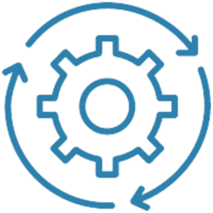
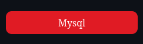
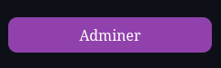
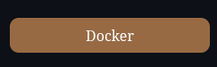
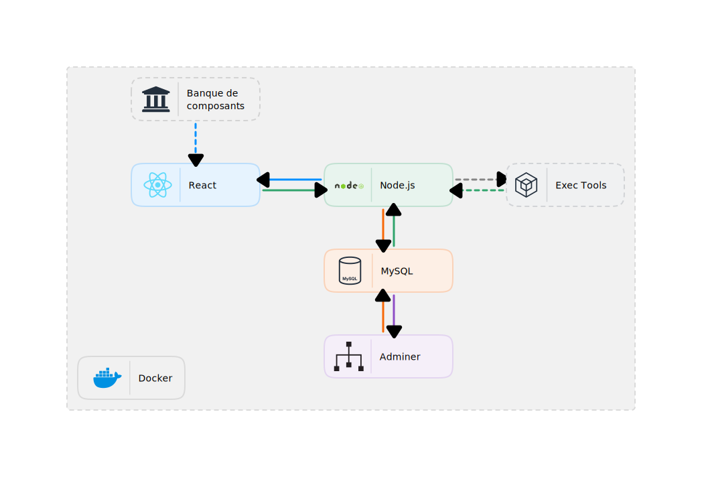

<p align="center">
  
</p>

# Ocade System

## Ocade System, c'est quoi ce truc ?
Architecture dockerisée permettant de créer une application complexe (front + back + bdd + ...).







## Ocade System, comment l'utiliser ?
Avant de lancer la commande d'initialisation vous devez vous assurer d'avoir plusieurs librairies d'installées sur votre ordinateur:
* [Node JS + npm](https://nodejs.org/en/)
* [Docker](https://docs.docker.com/engine/install/)
* Docker doit être démarré (sous linux: `systemctl start docker`)
* Lancer la commande d'initialisation:

## Installer le System Ocade 
```
npm init @ocade-compagny/ocade-system@latest
```
Répondez aux questions posées par le système et l'installation se lancera automatiquement.

## Structure Ocade System


## Explications, une image c'est bien mais c'est pas clair..!
* Adminer: interface graphque pour gérer la base de données
* Mysql: base de données utilisant le language SQL
* Node JS: serveur web
* Exec Tools: exécution de commandes sur le server (example: curl, wget, ...)
* React: librairie javascript pour créer des interfaces graphiques
* Banque de composants: composants (design Ocade Compagny) réutilisables pour créer des interfaces graphiques.
* Docker: dockerisation de toute la structure Ocade Compagny. Exécuter le `docker-compose.yml` avec la commande `docker-compose up -d`

## Le développement sans Docker ?
Vous pouvez développer hors du système Docker. Pour réussir à le faire, vous devez:
* Créer une BDD mysql (ouvert sur le port 3306).
* Avoir une instance PhpMyAdmin ou autre ouvert sur le port 8080 et pointant sur la bdd port 3306 (cette étape est facultative).
* Avoir Node Js et npm d'installé sur la machine.

### Pour commencer à developper:
* Assurez-vous que votre instance MySql est bien démarrée.
* Le fichier `.env` contient les données d'identification à la BDD. Renseignez les correctement.
* Déplacez-vous dans le dossier `server` et lancez la commande `npm run start` pour lancer le serveur Express.
* Déplacez-vous dans le dossier `application` et lancez la commande `npm run start` pour démarrer le serveur de développement de React.

### Ok ! Et le build de l'application ?
Lorsque votre application est prêt à être déployée:
* Bdd: exportez et importez votre bdd sur votre serveur de déploiement.
* Server Express: rien de particulier à faire. Vous devrez le lancez sur votre server de déploiement avec la même commande `npm run start`. Un utilitaire pratique pour gérer vos instances Express sur les serveurs de déploiement est la librarie `pm2`. Vous l'avez peut être déja installé avec l'installateur Ocade System.
* React: vous avez seulement à lancer la commande `npm run build` dans le dossier application. Un dossier de build sera généré. Le serveur express (si il est en mode "production") est configuré pour servir le contenu du dossier build.
* Changer la variable d'environnement du fichier `.env`  ENV="development" à  ENV="production"

## Dans Docker ?
Lors de l'installation du système Ocade, le fichier `docker-compose.yml` à été exécuté par votre Docker. Les containers ont été créés et sont en cours d'exécution. Vous pouvez les voir avec la commande `docker ps`. Vous pouvez également les arrêter avec la commande `docker-compose stop`.
